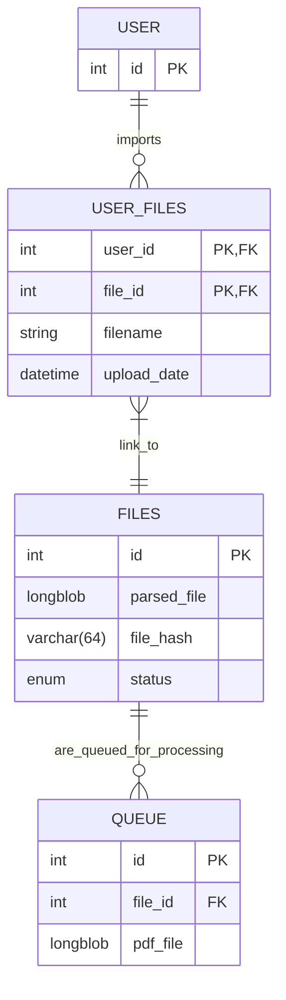

# pdf-rest-api
## Installaion
1. Create ``.env`` file in root dir example: 
```
APP_PORT=8080
MYSQL_ROOT_PASSWORD=rootpassword
MYSQL_DATABASE=pdf-rest-api-db
MYSQL_USER=myuser
MYSQL_PASSWORD=mypassword
```

2. Run ``docker-compose up --build``


## Database ER Diagram



## Enums
> |status| description|
> |------|------------|
> |`in_queue`| File is in queue for parser. |
> |`parsing`| File has been sent to parser server. |
> |`error`| Parser server has returned an error. |
> |`success`| Parser server has returned pdf file. |
> |`imported`| User had imported file into main application. |


## Requests
<details>
 <summary><code>POST</code> <code>/user/create</code>&nbsp;&nbsp;Creates a new user and returns id.</summary>

#### Response Examples
##### 200
```json
{
    "message": "User created successfully",
    "user_id": 1
}
```
</details>

<details>
 <summary><code>POST</code> <code>/user/{userId}/upload</code>&nbsp;&nbsp;Uploads user file and returns response</summary>

#### Input
```markdown
The input should be sent as `form-data` with the following key-value pair:

- `file`: The PDF file to be uploaded.
```

#### Response Examples
##### 200
```json
{
    "file_id": 1,
    "filename": "test.pdf",
    "message": "File uploaded successfully"
}
```

##### 413
```json
{
    "error": "File size exceeds 10MB limit"
}
```

##### 400

```json
{
    "error": "File is required", 
    "details": "http: no such file"
}
```
</details>

<details>
 <summary><code>GET</code> <code>/user/{userId}/files</code>&nbsp;&nbsp;Gets user files.</summary>

#### Response Examples
##### 200
```json
[
    {
        "upload_date": "2025-02-10 20:45:13",
        "filename": "test.pdf",
        "status": "in_queue"
    }
]
```
</details>

<details>
 <summary><code>DELETE</code> <code>/user/{userId}/file/{fileId}</code>&nbsp;&nbsp;Deletes file from queue.</summary>

#### Response Examples
##### 200
```json
[
    {
        "file_id": 1,
        "message": "File deleted successfully"
    }
]
```

##### 500
```json
[
    {
        "status":"error",
        "message":"Failed to delete file", 
        "details": "Error retrieving file status: sql: no rows in result set"
    }
]
```
</details>

<details>
 <summary><code>GET</code> <code>/queue</code>&nbsp;&nbsp;Gets next file from queue and also removes it.</summary>

#### Response Examples
##### 200
```json
[
    {
        "file_id": 3,
        "pdf_file": "file_contents"
    }
]
```
##### 404
```json
[
    {
        "status":"error",
        "message":"Queue is empty"
    }
]
```
</details>

<details>
 <summary><code>POST</code> <code>/file/{fileId}/parsed</code>&nbsp;&nbsp;Parse server returns parsed file.</summary>

#### Response Examples
##### 200
```json
[
    {
        "message": "Parsed information uploaded successfully"
    }
]
```
</details>

<details>
 <summary><code>POST</code> <code>/user/{userId}/file/{fileId/import</code>&nbsp;&nbsp;User imports parsed file.</summary>

#### Response Examples
##### 200
```json
[
    {
        "file_id": 3,
        "message": "File imported successfully"
    }
]
```
##### 500
```json
[
    {
        "status":"error",
        "message":"Failed to import file", 
        "details": "File is not in 'success' state. Cannot import."
    }
]
```
</details>

## Things that could be improved upon
- Rollback database on failed insert/delete
- And more...