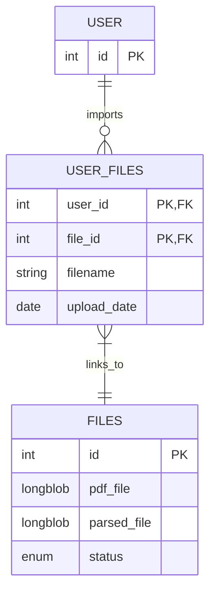

# pdf-rest-api
## Installaion
1. Create ``.env`` file in root dir example: 
```
APP_PORT=8080
MYSQL_ROOT_PASSWORD=rootpassword
MYSQL_DATABASE=pdf-rest-api-db
MYSQL_USER=myuser
MYSQL_PASSWORD=mypassword
```

2. Run ``docker-compose up --build``


## Database ER Diagram



## Enums
> |status| description|
> |------|------------|
> |`in_queue`| File is in queue for parser. |
> |`parsing`| File has been sent to parser server. |
> |`error`| Parser server has returned an error. |
> |`success`| Parser server has returned pdf file. |
> |`imported`| User had imported file into main application. |