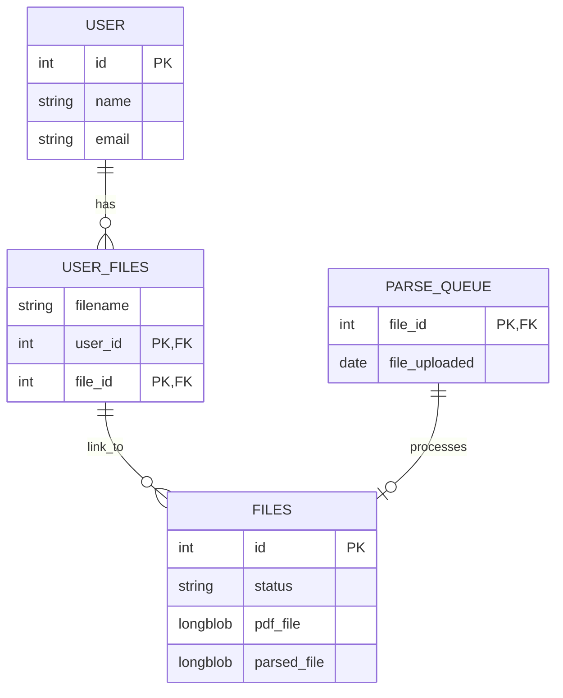

# pdf-rest-api
## Installaion
1. Create ``.env`` file in root dir example: 
```
APP_PORT=8080
MYSQL_ROOT_PASSWORD=rootpassword
MYSQL_DATABASE=pdf-rest-api-db
MYSQL_USER=myuser
MYSQL_PASSWORD=mypassword
```

2. Run ``docker-compose up --build``


## Database ER Diagram

