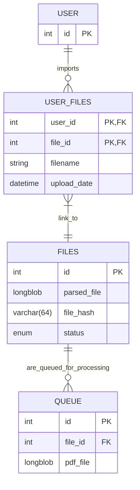

# pdf-rest-api
## Installaion
1. Create ``.env`` file in root dir example: 
```
APP_PORT=8080
MYSQL_ROOT_PASSWORD=rootpassword
MYSQL_DATABASE=pdf-rest-api-db
MYSQL_USER=myuser
MYSQL_PASSWORD=mypassword
```

2. Run ``docker-compose up --build``


## Database ER Diagram



## Enums
> |status| description|
> |------|------------|
> |`in_queue`| File is in queue for parser. |
> |`parsing`| File has been sent to parser server. |
> |`error`| Parser server has returned an error. |
> |`success`| Parser server has returned pdf file. |
> |`imported`| User had imported file into main application. |


## Requests for parser server
<details>
 <summary><code>GET</code> <code><b>/</b></code> <code>queue</code>&nbsp;&nbsp;&nbsp;&nbsp;Gets a new file from queue</summary>

##### Responses

> | http code     | content-type                      | response                                                            |
> |---------------|-----------------------------------|---------------------------------------------------------------------|
> | `200`         | `application/pdf`                 | `example.pdf`                                                       |
> | `204`         | `application/json`                | `{"message":"No files in queue"}`                                   |
</details>

<details>
 <summary><code>POST</code> <code><b>/</b></code> <code>parsed</code>&nbsp;&nbsp;&nbsp;&nbsp;Returns parsed file</summary>

##### Parameters

> | name             |  type     | data type      | description                          |
> |------------------|-----------|----------------|--------------------------------------|
> | `file`           |  optional  | binary (PDF)  | The parsed PDF file (if successful)  |
> | `error`          |  optional  | string (JSON) | Error message (if parsing failed)    |

##### Responses

> | http code     | content-type                      | response                                                            |
> |---------------|-----------------------------------|---------------------------------------------------------------------|
> | `200`         | `application/json`                | `{"message":"Upload successful"}`                                   |
</details>

## Requests for client

<details>
 <summary><code>POST</code> <code><b>/</b></code> <code>upload</code>&nbsp;&nbsp;&nbsp;&nbsp;Upload file</summary>

##### Parameters

> | name             |  type     | data type      | description                          |
> |------------------|-----------|----------------|--------------------------------------|
> | `file`           |  required | binary (PDF)  | The PDF file                          |

##### Responses

> | http code     | content-type                      | response                                                            |
> |---------------|-----------------------------------|---------------------------------------------------------------------|
> | `200`         | `application/json`                | `{"message":"Upload successful"}`                                   |
> | `415`         | `application/json`                | `{"message":"Only PDF files are allowed"`                           |
> | `400`         | `application/json`                | `{"message":"No file provided"`                                     |
</details>